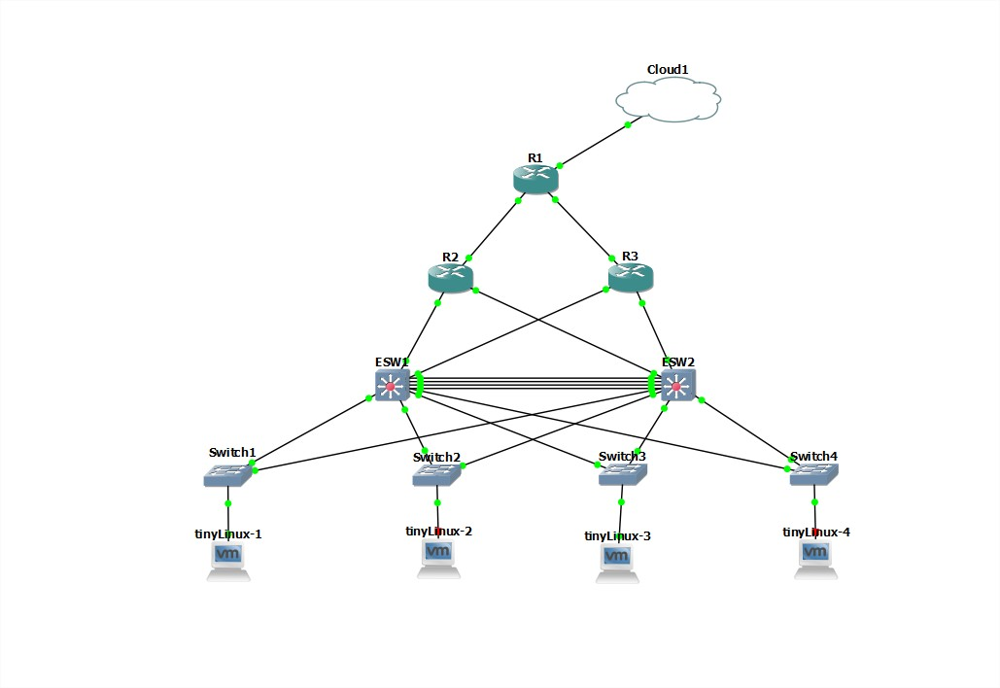
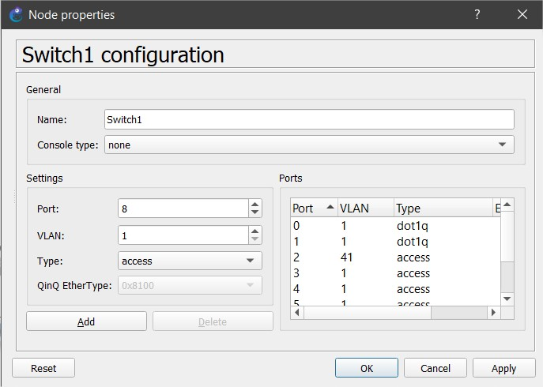
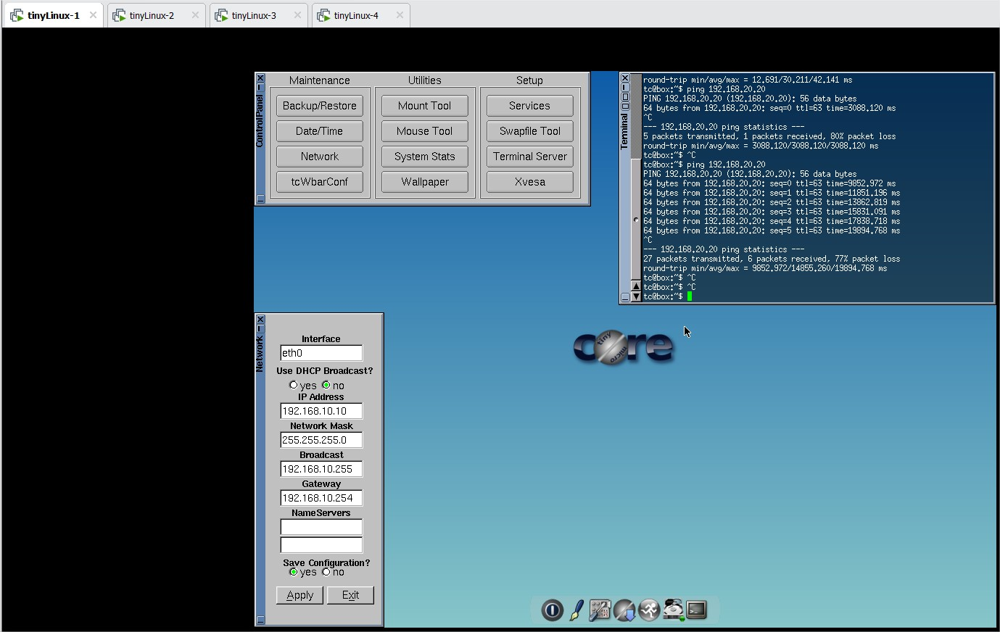
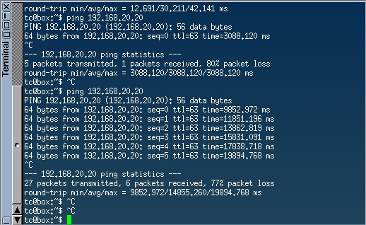
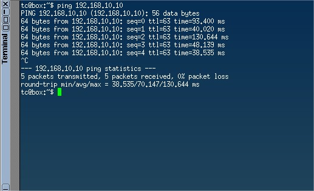
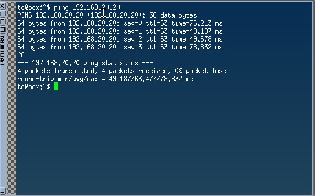
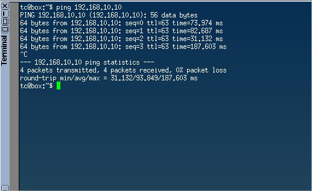

# Manual Tecnico

## Datos
- Grupo 31
## Topología empleada
### Topología 1

 Esta topología empleada utiliza las capas de Nucle, distribucion y acceso empleando <strong>3 routers</strong> para nucleo <strong>2 vlans</strong> para la capa de distribución <strong>switches y host</strong> para la capa de acceso

## Algunos comandos empleados

conf t  
int range f0/0 - 1 
no shu 
exit 
Donde estos primeros comandos nos serviran para poder configurar las interfaces y encenderlas 
int f0/0.1 
encapsulation dot1Q 41 
ip address 192.168.10.254 255.255.255.0 
exit 
Luego entraremos a las diferentes subinterfaces y configuraremos las ip que se le asignaran a cada vlan una direccion ip 

## Switches

Por ultimo configuraremos los puertos de nuestros switches indicando que el puerto 0 y 1 estarán conectados a un grupo de EtherSwitch de modo trunk mientras que los puertos 2 correspondera a ser de tipo access y le asignaremos a cada uno una vlan en especifico la cual nos servira para poder asignarle una direccion ip a nuestros host.

## Hosts

Una vez realizada toda la configuracion anterior se procede a configurar cada host, para ellos lo que se hace es configurar cada dirección ip que va a corresponder a nuestros respectivos host, le indicaremos la mascara de red, que fue la misma que configuramos en el Router, y seguido a esto le indicaremos los gateway que son las direcciones ip que le asignamos a cada subinterfaz de nuestros routers.

## Envio de paquetes

